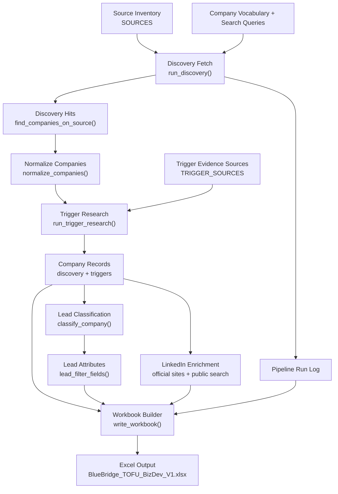

# BlueBridge TOFU BizDev Pipeline

This pipeline builds `BlueBridge_TOFU_BizDev_V1.xlsx` from approved public sources, search-derived discovery, trigger evidence, classification, and LinkedIn enrichment.

## How It Works

1. **Approved sources are defined**
   `SOURCES` lists rankings, accelerators, conferences, VC portfolios, grants, regulatory databases, and jobs sources. Accelerator sources only run when they have a source-specific adapter; generic accelerator page scanning is skipped.

2. **Company names are matched or discovered**
   Source-page adapters match known aliases from `COMPANY_REGISTRY` and extract conservative company-like link text for supported source types. The Google News RSS adapter can also create provisional company records from configured search queries when a result title/snippet names a company. YC Healthcare uses YC's public Algolia-backed directory query for `Healthcare`, paginates the results, and sorts them by launch date.

3. **Hits are normalized into company records**
   `normalize_companies()` groups discovery hits by company and carries over website, geography, and product type metadata.

4. **Trigger evidence is checked**
   Search results can create trigger evidence from the same article URL used for discovery when they describe funding, launch, approval, or regulatory clearance. Accelerator, conference, VC, grant, regulatory, and jobs adapters also create source-type trigger evidence from the same public URL.

5. **LinkedIn links are enriched**
   Official company and team pages are checked first, with cached DuckDuckGo public-search results as fallback. Every lead is eligible for a company LinkedIn URL; only leads whose derived `Evidence year` is exactly `2026` are researched for executive, technical/R&D, and quality/QA contacts. Ambiguous matches are rejected and incomplete results are explicitly flagged.

6. **Companies are classified**
   `classify_company()` assigns a persona and BBT quadrant. `lead_filter_fields()` derives product area, company type, stage, hiring signal, funding stage, geography, evidence year, and trigger type for the consolidated leads table.

7. **Workbook sheets are written**
   `write_workbook()` creates the final Excel workbook with summary, source, raw evidence, trigger audit, and consolidated lead-review tabs.

## Workbook Tabs

| Sheet | Purpose |
| --- | --- |
| `Pipeline Summary` | Run date and top-level counts |
| `Pipeline Run Log` | Source fetch/skip status |
| `Source Inventory` | All approved sources and adapter status |
| `Source Playbooks` | Manual search instructions by source type |
| `Discovery Hits` | Raw company-source matches for auditability |
| `Leads` | One consolidated company-level review row per discovered company |
| `Trigger Log` | Verified trigger events |

## Current Limitation

The system is partly automated. Google News RSS, YC's directory query, named accelerator adapters, and first-pass source-page adapters for non-accelerator source types are fetched directly; accelerator sources need deeper source-specific adapters before they run.
